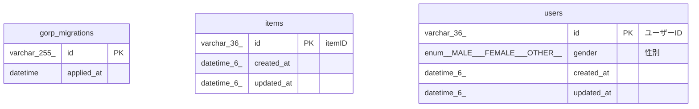

# test_service

## Tables

| Name | Columns | Comment | Type |
| ---- | ------- | ------- | ---- |
| [gorp_migrations](gorp_migrations.md) | 2 |  | BASE TABLE |
| [items](items.md) | 3 |  | BASE TABLE |
| [users](users.md) | 4 |  | BASE TABLE |

## Relations

---

> Generated by [tbls](https://github.com/k1LoW/tbls)
