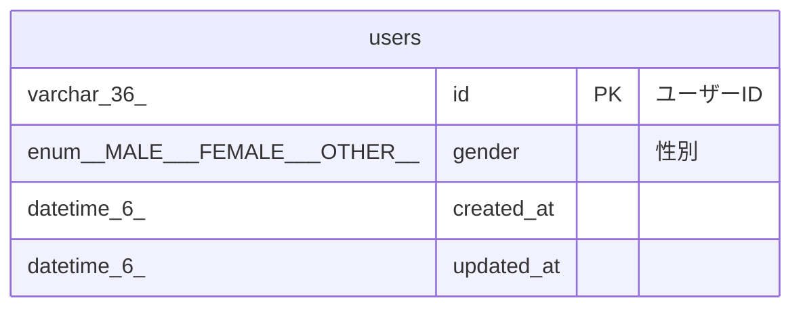

# users

## Description

<details>
<summary><strong>Table Definition</strong></summary>

```sql
CREATE TABLE `users` (
  `id` varchar(36) CHARACTER SET utf8mb4 COLLATE utf8mb4_0900_bin NOT NULL COMMENT 'ユーザーID',
  `gender` enum('MALE','FEMALE','OTHER') COLLATE utf8mb4_0900_bin NOT NULL COMMENT '性別',
  `created_at` datetime(6) NOT NULL DEFAULT CURRENT_TIMESTAMP(6),
  `updated_at` datetime(6) NOT NULL DEFAULT CURRENT_TIMESTAMP(6) ON UPDATE CURRENT_TIMESTAMP(6),
  PRIMARY KEY (`id`)
) ENGINE=InnoDB DEFAULT CHARSET=utf8mb4 COLLATE=utf8mb4_0900_bin
```

</details>

## Columns

| Name | Type | Default | Nullable | Extra Definition | Children | Parents | Comment |
| ---- | ---- | ------- | -------- | ---------------- | -------- | ------- | ------- |
| id | varchar(36) |  | false |  |  |  | ユーザーID |
| gender | enum('MALE','FEMALE','OTHER') |  | false |  |  |  | 性別 |
| created_at | datetime(6) | CURRENT_TIMESTAMP(6) | false | DEFAULT_GENERATED |  |  |  |
| updated_at | datetime(6) | CURRENT_TIMESTAMP(6) | false | DEFAULT_GENERATED on update CURRENT_TIMESTAMP(6) |  |  |  |

## Constraints

| Name | Type | Definition |
| ---- | ---- | ---------- |
| PRIMARY | PRIMARY KEY | PRIMARY KEY (id) |

## Indexes

| Name | Definition |
| ---- | ---------- |
| PRIMARY | PRIMARY KEY (id) USING BTREE |

## Relations



---

> Generated by [tbls](https://github.com/k1LoW/tbls)
